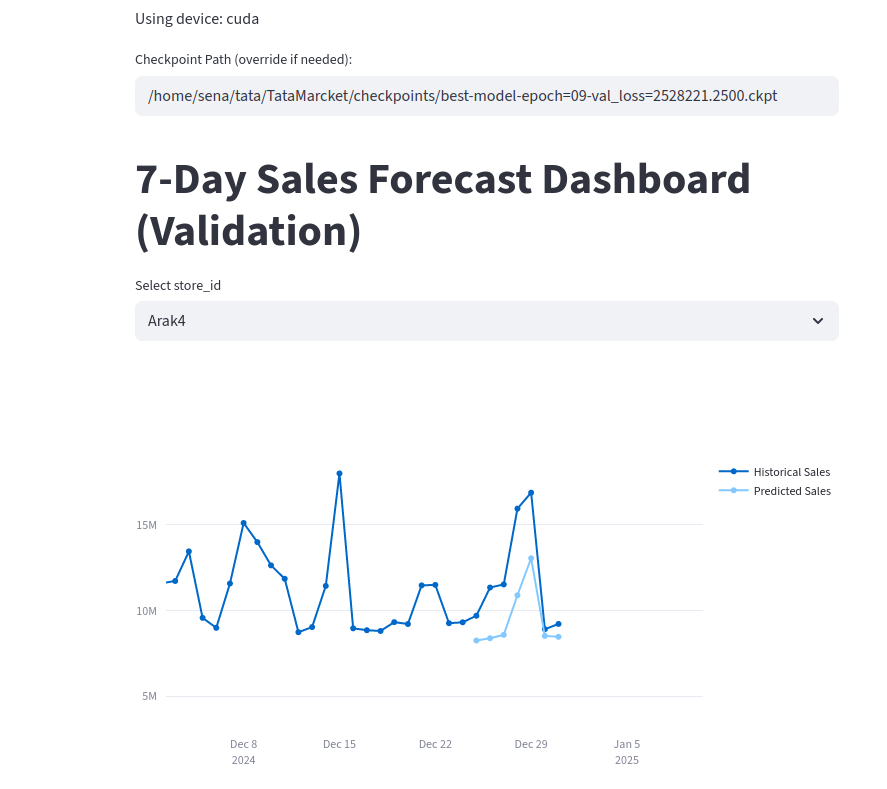
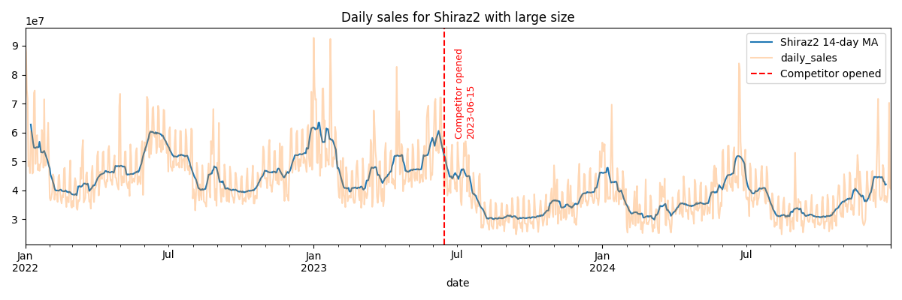

## Project Overview
This project simulates daily sales for **InnovateMart** stores and trains a **Temporal Fusion Transformer (TFT)** model to forecast the next 7 days of sales.

---

## Project Structure
``` bash
. ├── data/ 
│ └── simulated_innovatemart_daily_sales.csv # Simulated sales data 
│ └── *.png # Marcket dialy sales plot 
├── checkpoints/ 
│ └── BEST_CHECKPOINT.txt # Path to the latest trained model 
│ └── bes_model*.ckp # Best trained model 
├── generate_data.py # Generate data for sales prediction 
├── stream.py # Streamlit UI for sales prediction 
├── model.py # TFT model training script 
├── config.py # City and population configuration 
└── README.md # This file
```


---

## web page
  
---

## Installation(Step1)
1. (Optional) Create a virtual environment:
```bash
python -m venv venv
source venv/bin/activate   # Linux/Mac
venv\Scripts\activate      # Windows
```
## Install required libraries:
```bash
pip install -r requirements.txt
```

Main libraries:

pandas, numpy, matplotlib, plotly
streamlit
torch, pytorch-lightning
pytorch-forecasting


## Configuration (`config.py`)

The `config.py` file contains all the customizable parameters for the project.  
It is divided into three main sections:

### 1. `cities`
A dictionary mapping city names to their population.  
This can be used for data filtering, scaling, or population-based analysis.

**Example:**
```python
cities = {
    "Tehran": 8846782,
    "Isfahan": 1570860,
    ...
}
```
### 2. public_cfg
General configuration settings for data paths, model parameters, and date ranges.

* DATA_PATH:	Directory containing input CSV files or datasets	default = "data"
* BEST_CHECKPOINT_FILE:	Directory where the trained model checkpoint is saved	default =  "checkpoints"
* NUM_STORES:	Number of stores or data series used for training	default = 5
* START_DATE:	First date in the dataset (format: YYYY-MM-DD)	default = "2022-01-01"
* END_DATE:	Last date in the dataset (format: YYYY-MM-DD)	default = "2024-12-31"
* COMPETITOR_DATE:	Date when competitor data starts affecting the model	default = "2023-06-15"
* MAX_ENCODER_LENGTH:	Number of past time steps the model sees during training	default = 30
* PRED_HORIZON:	Number of future time steps the model predicts	default = 7

### 3. train_cfg
Training-related settings such as dataset split, batch size, and epochs.

* TRAIN_RATIO:	Fraction of the dataset used for training (rest is validation/test)	default = 0.8
* BATCH_SIZE:	Number of samples per training batch	default = 512
* MAX_EPOCHS:	Maximum number of training epochs	default = 2
Usage:
Changing these values in config.py will automatically update the behavior of both the training script and the prediction (streaming) script without modifying their code.

### Notice
You can change config.py to create data and model without using argparser, but if you want spesific data or model you can using argparser

------

## Simulate Sales Data(Step2)
``` bash
python generate_data.py --n_stores 5 --start_date 2022-01-01 --end_date 2024-12-31 --save ./data
```

* --n_stores : Number of stores
* --start_date & --end_date : Simulation date range
* --save : Path to save generated data

You can see image of store in save folder

  

## Train TFT Model(Step3)
``` bash
python model.py --data_path data/simulated_innovatemart_daily_sales.csv \
                          --save_dir checkpoints \
                          --encoder_len 30 \
                          --pred_len 7 \
                          --train_ratio 0.8 \
                          --batch_size 512 \
                          --max_epochs 10
```
* Model is trained for all stores together
* Best model checkpoint is saved in BEST_CHECKPOINT.txt

## Run Streamlit UI(Step4)
``` bash
streamlit run stream.py
```
Features:

* Select a store and see historical sales
* Forecast 7-day sales
* Compare predictions with actual data
* View variable importance (feature importance)

## Important Notes
* Model path is automatically read from BEST_CHECKPOINT.txt
* You can manually change the model path if needed
* GPU is recommended for faster predictions, but CPU works too
